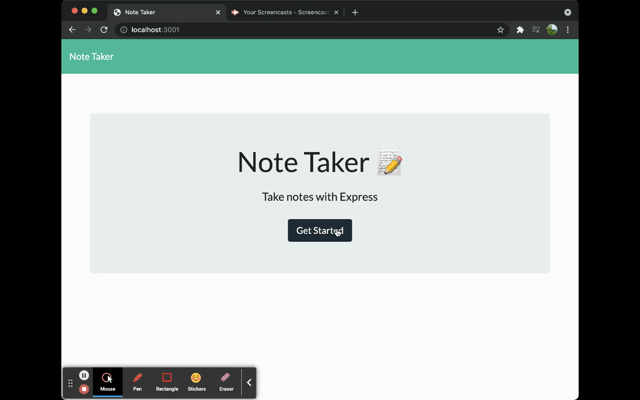

# Note-Taker
Note-taker is an application that can be used to wrtie and save notes. The application was created with the intent to make organizing and keeping track of tasks easier for users. The application uses an express.js back-end and saves and retrieves note data from a JSON file. When the application is launched, users will be able to see previous notes displayed on the left-hand side in the notes container and when an exisiting note is clicked it is displayed in the righ-hand container. User's are able to create new notes and save them which in turn will be added to the notes list.

## User Story
AS A small business owner
I WANT to be able to write and save notes
SO THAT I can organize my thoughts and keep track of tasks I need to complete

## Technologies Used
* express.js
* node module

## Github URL
https://github.com/Araceli4690/note-taker.git

## Heroku URL
https://note-taker-l.herokuapp.com/notes